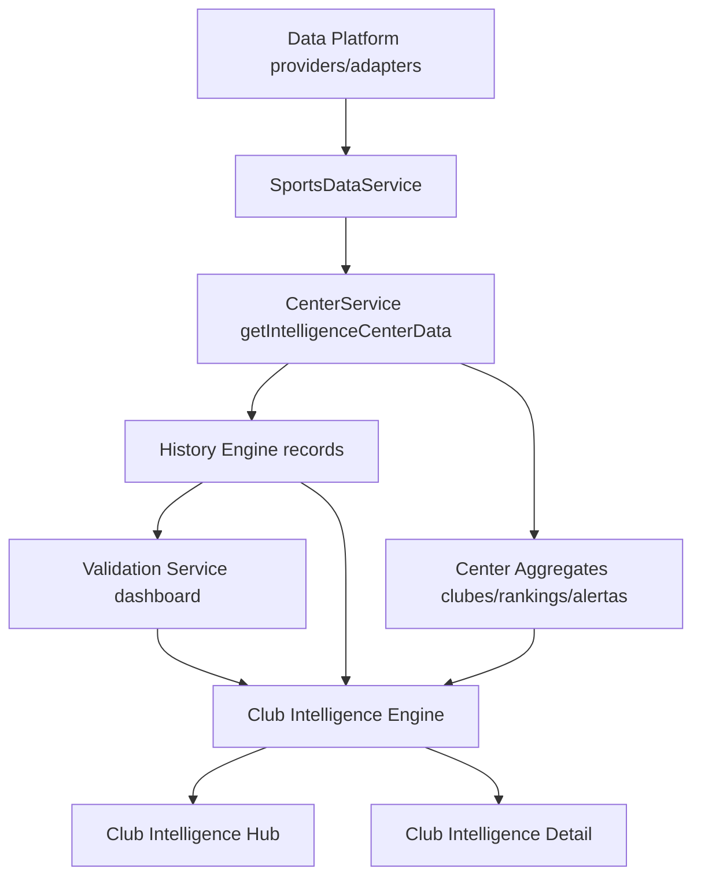

# CLUB INTELLIGENCE S24

## Objetivo

Construir el primer producto de Inteligencia Deportiva centrado en clubes como radiografia metodologica dinamica, reutilizando el ecosistema S24 existente.

No es una ficha estatica de club.

## Reutilizacion De Arquitectura Existente

Club Intelligence reutiliza de forma directa:

- Motor S24
- Narrative Engine
- Biblioteca Editorial
- Validation Engine
- Data Platform
- Centro de Inteligencia

Mecanismo de reutilizacion:

1. Se parte de `getIntelligenceCenterData()` para aprovechar pipeline de datos + seeding historico.
2. Se consume `s24HistoryEngine` para evolucion temporal y comparativas.
3. Se consume `s24ValidationService.generateDashboard()` para calidad/metrica del club.
4. Se usa `sportResolver` para pasaporte analitico versionado.
5. Se usa `createEditorialEngine` para narrativa e insights del club.

## Estructura Implementada

### Backend/App layer

- `lib/intelligence-s24/club-intelligence/types.ts`
- `lib/intelligence-s24/club-intelligence/engine.ts`
- `lib/intelligence-s24/club-intelligence/service.ts`
- `lib/intelligence-s24/club-intelligence/index.ts`

### UI pages

- `app/club-intelligence/page.tsx` (hub de clubes)
- `app/club-intelligence/[slug]/page.tsx` (detalle por club)
- `app/components/ClubIntelligenceHub.tsx`
- `app/components/ClubIntelligenceS24View.tsx`

## Flujo De Datos Del Producto

## Modelo Funcional Por Club

Cada club incluye:

1. Perfil Institucional
- nombre
- escudo
- pais
- competicion
- estadio
- entrenador
- temporada

2. Estado Competitivo
- S24 Index
- Rating
- Tendencia
- Riesgo
- Confianza

3. Evolucion Temporal
- ultimos partidos
- evolucion del indice
- tendencias

4. Fortalezas
- ataque
- defensa
- localia
- consistencia
- eficiencia

5. Debilidades
- factores negativos
- riesgos
- caidas

6. Narrativa Inteligente (automatica)
- Resumen Ejecutivo
- Estado del Club
- Perspectiva Competitiva
- Riesgos
- Fortalezas

7. Insights (automaticos)

8. Alertas (motor/centro)

9. Historial
- apariciones
- balance por modelo
- tendencias
- indice promedio

10. Pasaporte Analitico
- mismo contrato y estandar de Informe S24

## Contratos Principales

`ClubIntelligenceData` agrupa:

- `club`
- `competitiveState`
- `evolution`
- `strengths`
- `weaknesses`
- `intelligentNarrative`
- `insights`
- `alerts`
- `history`
- `passport`
- `validation`

## Notas De Compatibilidad

- No se modifica Home.
- No se modifica Premium.
- No se modifica la logica del Motor S24.
- No se duplica calculo de center/motor/validation.
- Se preserva compatibilidad total del sistema actual.

## Evolucion Recomendada

Siguientes mejoras futuras sin romper contrato:

1. Enriquecer perfil institucional con provider dedicado de clubes (estadio/coach oficiales).
2. Añadir serie temporal avanzada y comparador multi-club.
3. Incorporar endpoints API versionados para Club Intelligence.
4. Agregar tests unitarios al engine de agregacion por club.
