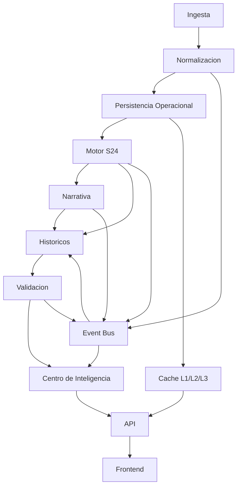
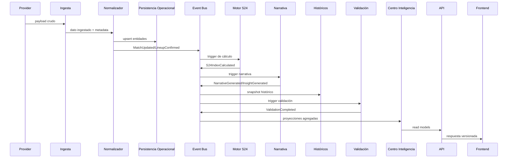

# DATA PLATFORM ARCHITECTURE - SPORTIVA24

## 1. Objetivo

Definir la arquitectura de datos oficial de Sportiva24 para soportar crecimiento multideporte y operación a escala masiva, sin acoplarse a una tecnología de base de datos específica.

Este documento cubre diseño conceptual de:

- ingesta
- normalización
- persistencia
- eventos
- cache
- históricos
- validación
- observabilidad
- APIs de consumo

## 2. Principios Rectores

1. Separación de responsabilidades por capa.
2. Contratos estables y versionados.
3. Procesamiento idempotente en pipelines críticos.
4. Event-first para desacoplamiento entre módulos.
5. Lecturas optimizadas por producto (query models).
6. Persistencia poliglota conceptual (operacional/analítica/eventos).
7. Observabilidad transversal desde provider hasta frontend.
8. Evolución backward-compatible por versiones.

## 3. Capas De Arquitectura



### 3.1 Ingesta

Responsabilidad:

- recibir datos crudos desde proveedores externos, feeds internos y procesos batch.

Componentes conceptuales:

- Provider Connectors
- Pull Scheduler
- Webhook Receiver
- Rate-limit Controller
- Retry/Backoff Controller

Salida:

- Raw Events/Data con metadata de origen, timestamp, versión de proveedor y checksum.

### 3.2 Normalización

Responsabilidad:

- transformar payloads heterogéneos en contratos de dominio Sportiva24.

Componentes conceptuales:

- Adapter Engine por deporte/proveedor
- Entity Resolver (club, jugador, competición)
- Deduplication Service
- Quality Rules (schema, rangos, completitud)

Salida:

- Domain Records consistentes con el modelo oficial.

### 3.3 Persistencia

Responsabilidad:

- almacenar estado operativo actual y trazabilidad histórica.

Separación conceptual:

- Operational Store: estado vivo transaccional
- Analytical Store: agregados y series para analytics
- Event Store: secuencia inmutable de eventos
- Document Store: narrativa/editorial/informes
- Search Index: consultas textuales/facetadas

### 3.4 Motor S24

Responsabilidad:

- consumir datos normalizados, perfiles y señales para calcular índice, riesgo, tendencia y confianza.

Notas:

- mantiene contrato estable de salida
- no depende de proveedor específico
- produce eventos de cálculo

### 3.5 Narrativa

Responsabilidad:

- transformar salida del motor en narrativa editorial explicable y versionada.

Salida:

- documentos narrativos
- insights
- evidencias enlazadas

### 3.6 Históricos

Responsabilidad:

- conservar snapshots y secuencia temporal de predicciones, resultados, diferencias y aprendizaje.

### 3.7 Validación

Responsabilidad:

- comparar predicción vs outcome real, generar métricas de precisión y confianza por deporte/proveedor/modelo.

### 3.8 Centro De Inteligencia

Responsabilidad:

- construir vistas agregadas por deporte, clubes, competiciones, tendencias y alertas.

### 3.9 API

Responsabilidad:

- exponer datos por contrato versionado para web, móvil, clientes enterprise y white label.

Contrato unificado de salida:

- IntelligenceProfile (v1) como objeto base para productos inteligentes.
- especializaciones por dominio (match/club/league/player/season) sin duplicar bloques comunes.

### 3.10 Frontend

Responsabilidad:

- consumir read models y APIs sin acoplarse a providers ni almacenamiento interno.

Lineamiento Fase 1 consolidada:

- frontend y servicios de aplicacion deben preferir IntelligenceProfile como contrato de consumo transversal.

## 3.11 Capa De Perfil De Inteligencia

Nueva capa transversal de consolidacion:

- Domain Contract: `lib/domain/intelligenceProfile.ts`
- Product Adapters: `lib/intelligence-s24/intelligence-profile/adapters.ts`
- Consumers: Motor, Narrative, Validation, History, Centro

Objetivo:

- eliminar duplicacion conceptual entre productos;
- habilitar evolucion de Fase 2 sin romper el nucleo.

## 4. Modelo De Persistencia (Conceptual)

No se impone tecnología concreta; se define un diseño logical-first.

### 4.1 Operational Data (OLTP conceptual)

Entidades principales:

- partidos
- clubes
- jugadores
- competiciones
- temporadas
- lineups
- eventos en vivo
- estados de proveedor

Requisitos:

- consistencia por entidad agregada
- upserts idempotentes
- claves naturales + surrogate ids
- auditoría de cambios

### 4.2 Analytical Data (OLAP conceptual)

Objetos principales:

- rankings históricos
- métricas de rendimiento por ventana temporal
- validaciones agregadas
- KPIs de motor y narrativa
- cohortes por deporte/competición/temporada

Requisitos:

- particionamiento temporal
- almacenamiento columnar conceptual
- snapshots diarios y materializaciones

### 4.3 Event Store

Objetos:

- secuencia de eventos de dominio y sistema

Requisitos:

- append-only
- orden por stream
- replay parcial/total
- idempotencia por eventId

### 4.4 Document Store

Objetos:

- narrativas
- insights
- informes editoriales
- evidencias narrativas

Requisitos:

- versionado por documento
- metadata de idioma y metodología

### 4.5 Search Projection

Objetos:

- índices de consulta por slug, equipo, competición, fecha, tags editoriales

Requisitos:

- reconstrucción desde eventos/snapshots
- consistencia eventual aceptada

## 5. Modelo De Eventos (Event Bus Conceptual)

## 5.1 Contrato Base De Evento

```ts
interface DomainEvent<TPayload = unknown> {
  id: string;               // UUID/ULID
  type: string;             // MatchCreated, NarrativeGenerated, etc.
  timestamp: string;        // ISO UTC
  source: string;           // provider, engine, service
  version: string;          // semver del contrato de evento
  correlationId?: string;   // traza transversal
  causationId?: string;     // evento origen
  payload: TPayload;
}
```

Campos obligatorios solicitados:

- identificador: id
- timestamp: timestamp
- payload: payload
- origen: source
- versión: version

## 5.2 Catálogo Inicial De Eventos

- MatchCreated
- MatchUpdated
- MatchFinished
- GoalScored
- PlayerInjured
- LineupConfirmed
- NarrativeGenerated
- InsightGenerated
- ValidationCompleted
- RankingUpdated

Eventos adicionales recomendados:

- ProviderFetchStarted
- ProviderFetchFailed
- ProviderFetchSucceeded
- S24IndexCalculated
- HistoricalSnapshotCreated
- CacheWarmupCompleted
- ApiContractVersionPublished

## 5.3 Streams Conceptuales

- stream.match.{matchId}
- stream.competition.{competitionId}
- stream.analysis.{analysisId}
- stream.validation.{sport}.{season}
- stream.provider.{providerId}

## 5.4 Garantías

- At-least-once delivery (conceptual)
- Deduplicación por id
- Reintento con backoff exponencial
- DLQ conceptual para eventos no procesables

## 6. Estrategia De Cache Multicapa

Arquitectura requerida:

- L1: Memory Cache (proceso)
- L2: Distributed Cache (compartido)
- L3: Persistent Storage (source of truth)

### 6.1 Reglas De Uso

- L1 para lecturas ultra frecuentes y payloads pequeños.
- L2 para compartir estado entre instancias.
- L3 para consistencia y recuperación.

### 6.2 TTL Sugerido Por Tipo De Dato

- live match clock/events: 2-10 segundos
- lineup/status pre-match: 30-120 segundos
- featured matches/home widgets: 60-300 segundos
- rankings diarios: 15-60 minutos
- narrativa e informe post cálculo: 6-24 horas
- sport profiles/version metadata: 24 horas
- catálogos estáticos (deportes/competiciones): 24-72 horas

### 6.3 Políticas De Invalidación

- Event-driven invalidation por MatchUpdated/MatchFinished/RankingUpdated
- Time-based expiration por TTL
- Manual purge para incidentes
- Warmup programado para endpoints críticos

## 7. Observabilidad End-To-End

## 7.1 Métricas

Categorías mínimas:

- Ingesta: tasa de éxito, latencia por proveedor, retries
- Normalización: records válidos/invalidos, deduplicación
- Motor S24: tiempo de cálculo, fallback factors, distribución de índices
- Narrativa: tiempo de generación, longitud, tasa de publicación
- Validación: precisión por deporte/proveedor/modelo
- API: p50/p95/p99, throughput, error rate
- Cache: hit ratio L1/L2, evictions, stale reads

## 7.2 Logs

Formato estructurado (JSON conceptual) con:

- timestamp
- service
- operation
- providerId
- sport
- competition
- correlationId
- latencyMs
- outcome
- errorCode/errorMessage

## 7.3 Trazas

Trazabilidad distribuida con spans:

- ingest.fetch
- normalize.transform
- persist.upsert
- s24.calculate
- narrative.generate
- validation.evaluate
- api.respond

## 7.4 Dashboards Operativos

- Provider Reliability Dashboard
- S24 Engine Health Dashboard
- Narrative Throughput Dashboard
- Validation Quality Dashboard
- API Consumer Dashboard

## 7.5 Alertas

- degradación proveedor > umbral
- caída de precisión de validación
- incremento de fallback del motor
- p95 API sobre SLO
- caída de hit ratio cache

## 8. Versionado Y Compatibilidad

## 8.1 Objetos A Versionar

- SportProfile
- Motor S24
- Narrativa
- Metodología
- APIs
- Contratos de eventos
- Contratos de dominio

## 8.2 Política General

- Semantic Versioning para contratos públicos.
- Backward compatibility por al menos 2 versiones activas.
- Deprecation window con fecha de retiro.
- Version pinning por cliente enterprise.

## 8.3 Reglas Específicas

- SportProfile: `profileVersion` + `methodologyVersion` obligatorios.
- Motor S24: `engineVersion` en outputs y eventos de cálculo.
- Narrativa: `narrativeTemplateVersion` + locale.
- API: prefijo explícito (`/api/v1`, `/api/v2`).
- Event Contracts: `event.version` y schema registry conceptual.

## 9. Escalabilidad Objetivo

Capacidad conceptual objetivo:

- 30 deportes
- 500 competiciones
- millones de partidos históricos
- millones de usuarios
- API pública
- aplicaciones móviles
- clientes enterprise
- white label

## 9.1 Estrategias Clave

- particionamiento por deporte/competición/temporada/fecha
- arquitectura orientada a eventos y proyecciones
- separación read/write models
- cache jerárquica y warming selectivo
- aislamiento multi-tenant (enterprise/white label)
- throttling y cuotas por cliente API
- autoscaling por capa (ingesta/API/processing)

## 9.2 Multi-Tenant Conceptual

- tenantId obligatorio en capa API y contratos B2B
- configuración por tenant: branding, límites, features
- aislamiento lógico de datos y métricas

## 10. Seguridad Y Gobernanza De Datos

- clasificación de datos (public/internal/restricted)
- control de acceso por rol/tenant
- cifrado en tránsito y en reposo (conceptual)
- auditoría de acceso a contratos enterprise
- política de retención por tipo de dato
- data lineage desde proveedor hasta endpoint

## 11. Flujo De Datos Operativo



## 12. Roadmap De Implementación (Sin Cambiar Runtime Actual)

### Fase 1 - Foundation (0-6 semanas)

- consolidar contratos de evento y dominio
- definir schema registry conceptual
- estandarizar metadata de trazabilidad (correlationId, source, version)
- ampliar telemetría actual de providers/cache

### Fase 2 - Data Core (6-12 semanas)

- introducir Event Bus conceptual en arquitectura interna
- diseñar proyecciones read-model para centro e informes
- formalizar separación operational vs analytical stores
- definir catálogo oficial de entidades y ownership

### Fase 3 - Reliability & Quality (12-18 semanas)

- implementar validaciones de calidad de datos automáticas
- SLO/SLA por proveedor, motor y API
- pipeline de replay/reconstrucción de proyecciones
- runbooks de incidentes de datos

### Fase 4 - Scale & Products (18-28 semanas)

- habilitar contratos públicos de API versionados
- preparar consumo móvil y enterprise con cuotas
- modelo multi-tenant/white-label
- optimización de costos por capa de cache/persistencia

## 13. Decisiones De Diseño

1. Event-first para desacoplar evolución de módulos.
2. Persistencia separada por propósito (operacional, analítico, eventos, documentos).
3. Contratos versionados como mecanismo principal de compatibilidad.
4. Cache multicapa con invalidación por eventos.
5. Observabilidad transversal como requisito de plataforma, no complemento.

## 14. Compatibilidad Con El Estado Actual

Esta propuesta no modifica funcionalidad existente.

Se alinea con la base actual de Sportiva24:

- capa de providers/adapters/services ya existente
- failover y health monitor ya presentes
- motor S24 y sport profiles desacoplados
- historial/validación/centro ya modelados funcionalmente

La arquitectura propuesta define la evolución de plataforma para los próximos años sin romper el comportamiento actual.
