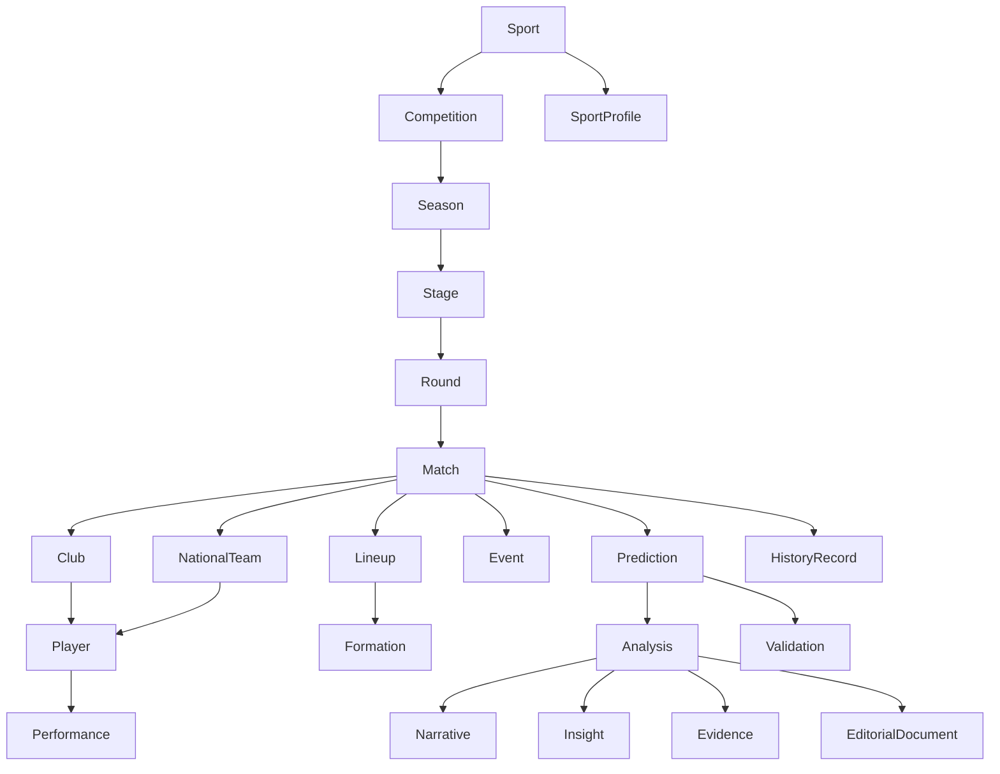

# DOMAIN MODEL - SPORTIVA24

## Objetivo

Definir el modelo de dominio oficial de Sportiva24 como representación única del ecosistema deportivo, reutilizable por:

- Motor S24
- Centro de Inteligencia
- Informe S24
- Narrative Engine
- API pública futura
- Apps móviles
- Integraciones enterprise

## Alcance

Implementación en `lib/domain` con separación explícita por capas:

- Entidades: `lib/domain/entities.ts`
- Value Objects: `lib/domain/valueObjects.ts`
- Domain Services: `lib/domain/services.ts`
- Factories: `lib/domain/factories.ts`
- Repositories: `lib/domain/repositories.ts`
- Policies: `lib/domain/policies.ts`
- Specifications: `lib/domain/specifications.ts`
- Relaciones oficiales: `lib/domain/relationships.ts`

## Diagrama Conceptual

## Entidades Del Dominio

### Núcleo deportivo

- Sport
- Competition
- Season
- Stage
- Round
- Match
- Club
- NationalTeam
- Player
- Coach
- Venue
- Official
- Country
- Region

### Estado competitivo

- LeagueTable
- Standing
- Ranking
- Statistic
- Performance
- Event
- Lineup
- Formation
- Injury
- Suspension

### Inteligencia y contenido

- Prediction
- Analysis
- Narrative
- Insight
- Evidence
- Validation
- HistoryRecord
- EditorialDocument
- SportProfile

## Value Objects Oficiales

- Score
- DateRange
- GeoLocation
- Money
- Percentage
- Rating
- Probability
- Confidence
- Risk
- Trend
- Version
- TimePoint
- AuditStamp
- EntityRef

## Relaciones Y Responsabilidades

### Cadena estructural

- Sport organiza Competition.
- Competition organiza Season.
- Season puede dividirse en Stage.
- Stage puede dividirse en Round.
- Round contiene Match.

### Cadena competitiva

- Match referencia dos participantes (Club o NationalTeam).
- Club y NationalTeam agrupan Player.
- Match produce Event, Lineup y Performance.
- LeagueTable agrega Standing.
- Ranking sintetiza posiciones por score/rating.

### Cadena de inteligencia S24

- Prediction se genera para un Match.
- Analysis interpreta Prediction y contexto.
- Narrative, Insight y Evidence enriquecen Analysis.
- Validation compara Prediction contra outcome real.
- HistoryRecord conserva trazabilidad.
- SportProfile define la configuración metodológica por deporte.

## Servicios De Dominio

Interfaces base definidas para:

- PredictionDomainService
- AnalysisDomainService
- NarrativeDomainService
- ValidationDomainService
- HistoryDomainService

Objetivo:

- Encapsular reglas de negocio transversales.
- Evitar lógica dispersa en UI o adapters.

## Factories

Factories tipadas para creación consistente de:

- Prediction
- Analysis
- Narrative
- Validation
- EditorialDocument

Beneficio:

- Menor acoplamiento de construcción.
- Inicialización uniforme de entidades.

## Repositories

Contratos repository-first para persistencia desacoplada:

- SportRepository
- CompetitionRepository
- SeasonRepository
- MatchRepository
- ClubRepository
- PlayerRepository
- PredictionRepository
- AnalysisRepository
- NarrativeRepository
- ValidationRepository
- HistoryRepository
- EditorialDocumentRepository
- SportProfileRepository

## Policies

Policies formales para decisiones booleanas de dominio:

- MatchEligibilityPolicy
- PredictionPublicationPolicy
- NarrativePublicationPolicy
- EditorialCompliancePolicy

## Specifications

Specifications para reglas componibles:

- MatchSpecification
- SportProfileSpecification
- DomainRule

## Casos De Uso (Ejemplos)

### Caso 1 - Generar predicción y análisis

1. MatchRepository devuelve Match.
2. SportProfileRepository devuelve perfil activo.
3. PredictionDomainService calcula Prediction.
4. AnalysisDomainService construye Analysis.
5. NarrativeDomainService produce Narrative.
6. HistoryDomainService registra eventos.

### Caso 2 - Validación post-partido

1. Se registra outcome real del Match.
2. ValidationDomainService compara Prediction vs real.
3. ValidationRepository persiste resultado.
4. HistoryRepository conserva la trazabilidad.

### Caso 3 - Publicación editorial

1. Analysis + Narrative pasan por Policy de compliance.
2. EditorialDocumentFactory crea documento.
3. EditorialDocumentRepository publica por locale/sport.

## Compatibilidad Con Código Actual

Se agregó un puente de compatibilidad sin alterar comportamiento:

- `lib/data/types/domain.ts` ahora reexporta contratos legacy desde `lib/domain/legacyDataContracts.ts`.
- Los contratos de Intelligence Center se movieron a `lib/domain/intelligenceCenter.ts` y se reexportan desde el componente para compatibilidad con imports existentes.

## Buenas Prácticas

- Mantener contratos de dominio fuera de React components.
- Referenciar entidades por `EntityRef`/`EntityId` para desacoplar agregados.
- Mantener value objects inmutables en la práctica de uso.
- Evitar duplicar enums de estado entre capas.
- Definir mapeadores explícitos entre proveedor externo y dominio.
- No agregar comportamiento de UI en entidades de dominio.

## Convenciones

- IDs como string estables.
- Tiempos en ISO UTC (`yyyy-mm-ddTHH:MM:SSZ`) dentro del dominio.
- Slugs normalizados en minúsculas.
- Entidades en singular, colecciones en plural.
- Contratos en inglés técnico para consistencia del código.
- Documentación funcional en español para alineación de negocio.

## Consolidacion Fase 1: IntelligenceProfile

Se incorpora la entidad de dominio unificada `IntelligenceProfile` en `lib/domain/intelligenceProfile.ts` como contrato oficial para todos los productos de inteligencia S24.

Bloques oficiales del contrato:

- Identity
- CompetitiveState
- Indicators
- Factors
- Narrative
- Insights
- Alerts
- History
- Evidence
- Validation
- AnalyticalPassport
- Metadata
- Version

Especializaciones oficiales:

- MatchIntelligenceProfile
- ClubIntelligenceProfile
- LeagueIntelligenceProfile
- PlayerIntelligenceProfile
- SeasonIntelligenceProfile

Regla de arquitectura:

- bloques comunes centralizados;
- extensiones solo por especializacion;
- sin duplicacion de contratos por producto.

## Evolución Recomendada

- Implementar mappers provider -> domain por deporte.
- Reemplazar estructuras in-memory por repositorios persistentes.
- Introducir pruebas unitarias de policies/specifications.
- Publicar esquemas OpenAPI alineados a estas entidades.
