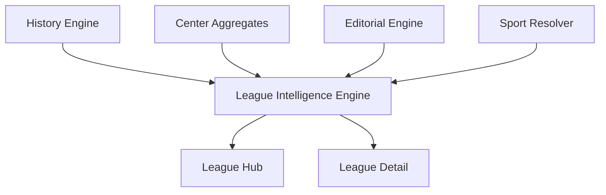

# LEAGUE INTELLIGENCE S24

## Objetivo

Construir un sistema de inteligencia para competiciones que muestre el estado competitivo integral de la liga, no solo una tabla.

## Reutilizacion Del Ecosistema

League Intelligence reutiliza:

- Motor S24 (salidas historicas)
- History Engine
- Centro de Inteligencia
- Biblioteca Editorial
- Sport Resolver / Sport Profile
- Pasaporte Analitico S24

## Estructura Implementada

### Modulo

- `lib/intelligence-s24/league-intelligence/types.ts`
- `lib/intelligence-s24/league-intelligence/engine.ts`
- `lib/intelligence-s24/league-intelligence/service.ts`
- `lib/intelligence-s24/league-intelligence/index.ts`

### Producto

- `app/league-intelligence/page.tsx`
- `app/league-intelligence/[slug]/page.tsx`
- `app/components/LeagueIntelligenceHub.tsx`
- `app/components/LeagueIntelligenceS24View.tsx`

## Cobertura Funcional Del EPIC

Cada competicion muestra:

1. Ranking S24
2. Nivel competitivo
3. Equilibrio
4. Volatilidad
5. Intensidad
6. Promedio ofensivo
7. Promedio defensivo
8. Tendencias
9. Equipos destacados
10. Equipos en crecimiento
11. Equipos en caida

Narrativa automatica:

- Estado de la liga
- Evolucion
- Insights

Alertas metodologicas:

- alertas por competencia y de riesgo agregado

Comparacion con temporadas anteriores:

- ventana actual vs ventana previa
- delta de indice, intensidad y volatilidad

## Flujo De Datos

## Restricciones Cumplidas

- No cambios en Home.
- No cambios en Premium.
- No cambios en comportamiento del Motor S24.
- Sin duplicar logica del ecosistema existente.

## Evolucion Recomendada

1. Comparacion intertemporada por temporada oficial de proveedor.
2. Modo multitemporada (N temporadas) con benchmarking.
3. API versionada para League Intelligence.
4. Tests unitarios para scoring de nivel/equilibrio/volatilidad.
