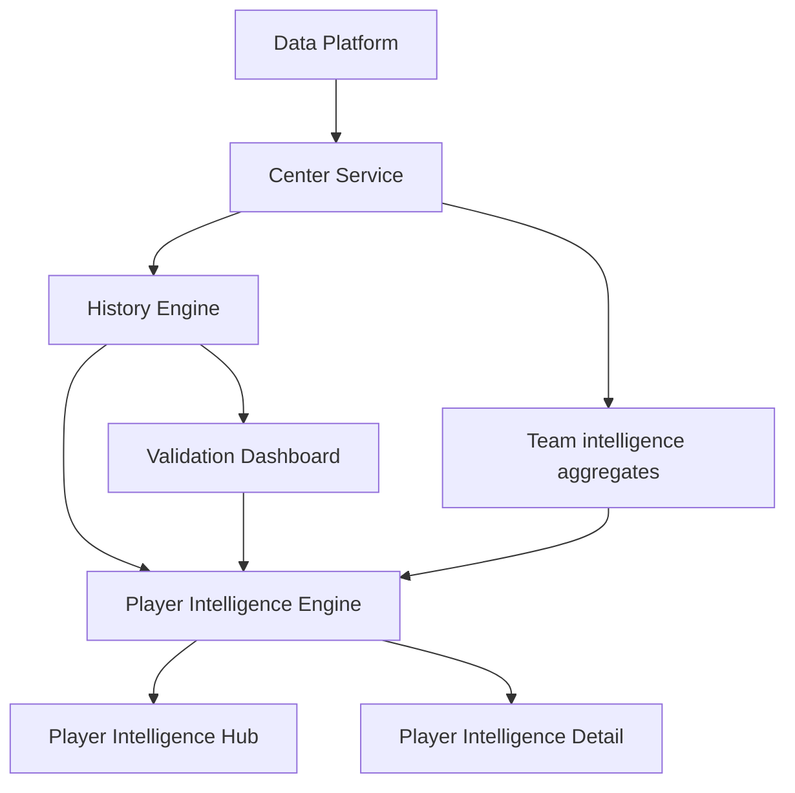

# PLAYER INTELLIGENCE S24

## Objetivo

Construir un perfil inteligente y metodologico para jugadores, evitando convertir la experiencia en una pagina de estadisticas crudas.

El producto se centra en evaluacion S24, narrativa automatica, comparacion de perfiles similares, historial y alertas.

## Reutilizacion Del Ecosistema Existente

Player Intelligence reutiliza:

- Motor y metodologia S24 (via historico de evaluaciones)
- Narrative Engine y Biblioteca Editorial
- Validation Engine
- Data Platform
- Centro de Inteligencia
- Pasaporte Analitico S24

## Arquitectura Implementada

### Modulo de inteligencia

- `lib/intelligence-s24/player-intelligence/types.ts`
- `lib/intelligence-s24/player-intelligence/engine.ts`
- `lib/intelligence-s24/player-intelligence/service.ts`
- `lib/intelligence-s24/player-intelligence/index.ts`

### Seccion del producto

- `app/player-intelligence/page.tsx` (hub)
- `app/player-intelligence/[slug]/page.tsx` (detalle)
- `app/components/PlayerIntelligenceHub.tsx`
- `app/components/PlayerIntelligenceS24View.tsx`

## Modelo Funcional

Cada perfil de jugador incluye:

1. Perfil del jugador
- nombre
- club
- rol
- pais
- competicion
- estado

2. Indicadores metodologicos
- Player Index
- Tendencia
- Consistencia
- Influencia
- Riesgo
- Disponibilidad
- Forma

3. Narrativa automatica
- Estado actual
- Evolucion
- Fortalezas
- Debilidades

4. Comparacion con jugadores similares
- ranking por similitud
- distancia metodologica sobre indicadores

5. Historial
- timeline de Player Index
- apariciones
- promedio de ventana

6. Alertas
- riesgo alto
- disponibilidad baja
- retroceso de forma

7. Pasaporte Analitico
- estandar compatible con Informe S24

## Flujo De Datos

## Notas De Diseño

- La evaluacion es metodologica y contextual, no estadistica cruda por proveedor.
- Se evita duplicar calculo del motor al reutilizar señales ya generadas por S24/history/center.
- Se mantiene compatibilidad con contratos y componentes existentes.

## Restricciones Cumplidas

- No se modifica Home.
- No se modifica Premium.
- No se altera comportamiento del Motor S24.
- No se rompe compatibilidad existente.

## Evolucion Recomendada

1. Integrar providers de jugadores para enriquecer perfil institucional real.
2. Añadir comparador positional por rol (defensor/medio/ataque).
3. Exponer endpoint API versionado para Player Intelligence.
4. Añadir tests unitarios del engine de scoring metodologico de jugador.
