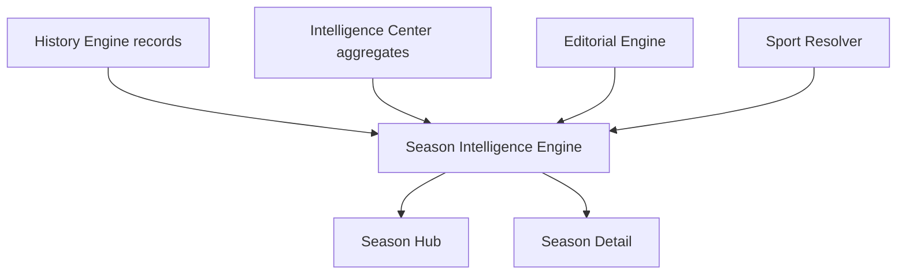

# SEASON INTELLIGENCE S24

## Objetivo

Analizar temporadas completas mediante el Motor S24 con un enfoque metodologico y evolutivo.

Season Intelligence no se limita a tablas; construye una lectura de temporada sobre:

- evolucion de S24 Index
- evolucion competitiva
- cambios de tendencia
- momentos criticos
- mejores y peores rachas
- cambios metodologicos
- narrativa automatica
- insights
- comparacion con temporadas anteriores

## Arquitectura Reutilizada

Season Intelligence reutiliza:

- Motor S24 (via historico de evaluaciones)
- History Engine
- Validation/Center ecosystem
- Biblioteca Editorial
- Sport Resolver / Sport Profile
- Pasaporte Analitico S24

## Estructura Implementada

### Modulo

- `lib/intelligence-s24/season-intelligence/types.ts`
- `lib/intelligence-s24/season-intelligence/engine.ts`
- `lib/intelligence-s24/season-intelligence/service.ts`
- `lib/intelligence-s24/season-intelligence/index.ts`

### Producto

- `app/season-intelligence/page.tsx`
- `app/season-intelligence/[slug]/page.tsx`
- `app/components/SeasonIntelligenceHub.tsx`
- `app/components/SeasonIntelligenceS24View.tsx`

## Flujo De Datos

## Modelo Funcional

Cada temporada expone:

1. Evolucion del S24 Index
2. Evolucion competitiva
3. Cambios de tendencia
4. Momentos criticos
5. Mejor racha
6. Peor racha
7. Cambios metodologicos
8. Narrativa automatica
9. Insights
10. Comparacion intertemporada
11. Pasaporte analitico

## Notas De Diseño

- La temporada se deriva de ventana temporal sobre `createdAt` de evaluaciones.
- Se evita duplicar logica del motor calculando sobre historico ya consolidado.
- La comparacion con temporada previa usa baseline del mismo torneo cuando existe.

## Restricciones Cumplidas

- Sin cambios en Home.
- Sin cambios en Premium.
- Sin cambios en comportamiento del Motor S24.
- Compatibilidad mantenida.

## Evolucion Recomendada

1. Incorporar temporadas oficiales desde proveedores (id estandar).
2. Añadir comparacion multi-temporada (n-3).
3. Exponer endpoint API versionado para Season Intelligence.
4. Agregar pruebas unitarias de deteccion de rachas y cambios de tendencia.
