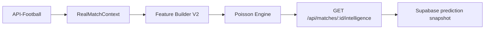

# SPORTIVA24 INTELLIGENCE ENGINE V2

## Estado

V2 incorpora un modelo probabilistico reproducible para futbol. La version `S24-IE-2.0.0` no usa ML, cuotas, xG de proveedor ni variables simuladas. Cada respuesta declara sus limites.

## Flujo

## Datos y leakage

API-Football aporta fixtures, tabla, H2H, ultimos partidos, alineaciones, estadisticas en vivo, estadisticas de temporada por equipo, lesiones y cuotas cuando el plan del proveedor habilita cada endpoint. El modelo V2 usa exclusivamente resultados finalizados anteriores al kickoff objetivo. Se separan partidos del local en casa y del visitante fuera. Fixtures futuros, en curso o posteriores al kickoff no entran a las features.

La respuesta expone `dataQuality.available` y `dataQuality.unavailable`. Las cuotas se normalizan por casa para retirar el margen y se muestran como `marketConsensus` junto con `modelMarketDivergence`; no modifican la probabilidad del modelo hasta completar backtesting y calibracion. xG y estadisticas individuales no se usan hasta que exista un contrato normalizado y cobertura verificable.

## Modelo

Con tres o mas partidos de muestra por lado:

$$
\lambda_{local} = \frac{GF_{local,casa}/N_{local,casa} + GC_{visitante,fuera}/N_{visitante,fuera}}{2}
$$

$$
\lambda_{visitante} = \frac{GF_{visitante,fuera}/N_{visitante,fuera} + GC_{local,casa}/N_{local,casa}}{2}
$$

Una matriz Poisson independiente hasta diez goles por equipo se renormaliza. Desde esa misma matriz se derivan 1X2, goles esperados, Over/Under 1.5/2.5/3.5, BTTS y los cinco marcadores más probables.

## Estados

- `insufficient-data`: menos de tres resultados locales o visitantes; no hay probabilidades.
- `limited-data`: entre tres y cuatro resultados por lado.
- `ready`: cinco o mas resultados por lado. Indica muestra minima, no calibracion historica.

`dataQuality.score` representa cobertura de bloques de datos, no probabilidad de acierto.

## API y snapshots

`GET /api/matches/:id/intelligence` es la fuente unica de prediccion V2. Devuelve fixture, proveedor, prediccion y `snapshotPersisted`.

La tabla `s24_prediction_snapshots` guarda match, timestamp, versiones, calidad y JSON de prediccion. Ejecutar `supabase/schema.sql` y configurar `SUPABASE_SERVICE_ROLE_KEY` en Vercel activa la escritura de servidor. Sin esa clave, no se abre escritura publica y `snapshotPersisted` queda en `false`.

## Backtesting y calibracion

No se reclama calibracion ni rendimiento hasta contar con snapshots persistidos y resultados finales. El siguiente paso es backtesting temporal, con cutoff anterior al kickoff, Log Loss y Brier para 1X2/mercados, MAE/RMSE para goles. Elo, normalizacion por liga, decay temporal, calibracion y ensembles solo se activaran con parametros seleccionados contra ese historial.

## Pruebas

`npm test` verifica matriz normalizada, suma de 1X2, complementos Over/Under y BTTS, reproducibilidad y bloqueo por muestra insuficiente. Ejecutar `npx tsc --noEmit`, `npm run lint` y `npm test` antes de desplegar.